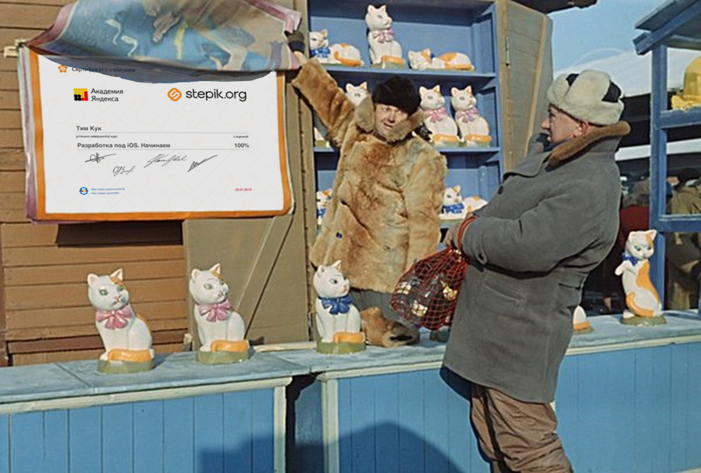

## Сертификат iOS-разработчика

В современном мире разработки программного обеспечения не важно, какими профессиональными навыками и опытом ты обладаешь. Важно лишь то, сколько у тебя сертификатов. Хватит смотреть курсы и читать книги. Начни путь профессионального iOS-разработчика с распечатки фальшивого сертификата!

Чтобы потенциальный работодатель не смог проверить достоверность твоего сертификата, используй в качестве его идентификатора MD5-хеш функцию, генерирующую длинную строку по типу «e8b8516f1174faf1065b9d7ad7dcd6b1». Пускай замучается вводить эту строку в браузер.

## Удиви друзей

Удиви друзей, маму и своего кота – покажи им сертификат с отличием об окончании курсов от «Академии Яндекс». 

Граждане студенты, внедряйте культурку. Вешайте сертификаты на сухую штукатурку. Налетай, торопись, скачивай живопись!

